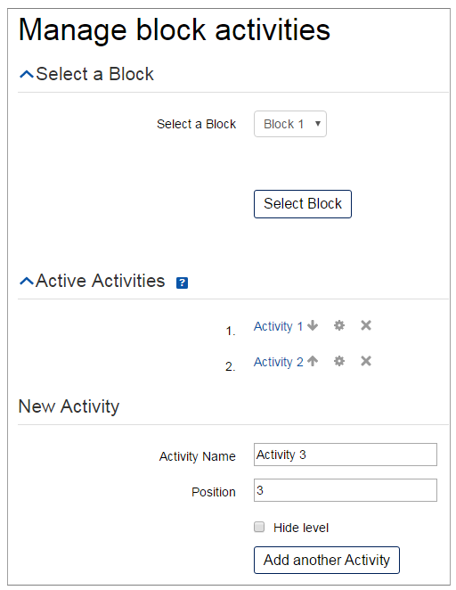
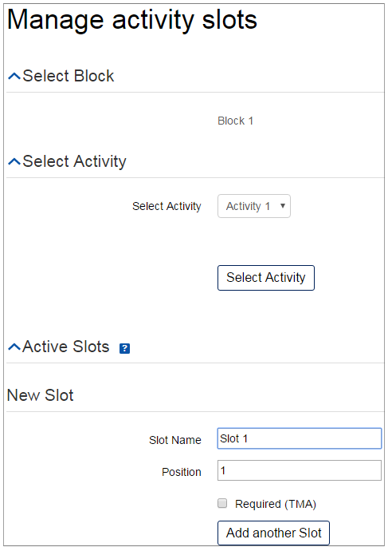
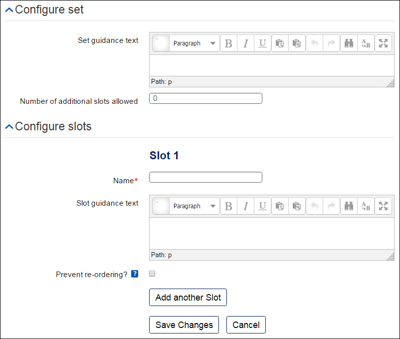
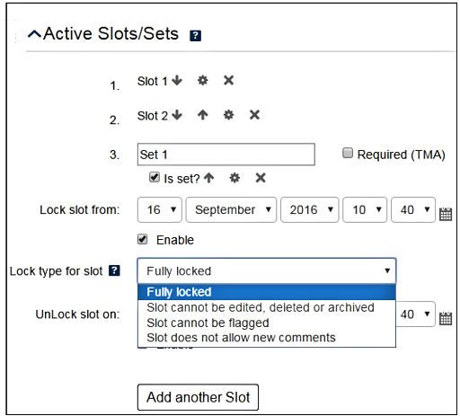

## Documentation

### Module settings

#### Theme

**Studio name shown to users**: Change the name of the OpenStudio that students see when they access the tool by entering the desired name in this part of the form. 

**Your word for...**: You can change the names of the 'My Module', 'My Group', 'My Studio Work' and 'My Pinboard' tabs by entering your desired terms in these fields.

#### Social settings

**Sharing level** sets how widely students can share their work. Setting an OpenStudio instance to 'Private' and 'Group' means your default sharing level is limited to the same settings.

* Private - only the owner can see it
* Group - visible to group members
* Module - visible to all course members
* Tutor - only the student and their tutor can see it (The student and 'tutor' should reside in the same group - module should also use a 'Grouping' for this feature to work)

**Sharing default**: This sets the default when the student creates work in OpenStudio. The options you are presented with depend on the 'Allowed sharing level'.

* Private - only the owner can see it
* Group - visible to group members
* Module - visible to all course members
* Tutor - visible only to the student and their tutor

**'Tutor' roles** Tick the roles who will be able to see slots that students share with 'My tutor'.

(The student and user with 'tutor' roles should reside in the same group. The common module settings for 'Grouping' should be set for this feature to work)

**Flags** Use these to specify the flags you want students to be able to use.

#### Custom features
**Enable 'My Module'**: This is a default feature of OpenStudio - untick it to disable this tab. 

**Enable pinboard**: This specifies the number of pinboard slots that students can upload. Entering '0' disables the feature.

**Enable versioning**: Use this to specify the number of versions students can upload for each slot. If students upload more than the number of allowed versions, the oldest version is disabled. If you would like to deleted versioning, enter '0'.

**Enable 'Locking'**: Tick this to enable locking for sets or slots.

**Slot description/comment uses HTML** and **Slot comment uses audio attachment**: Ticking these enables students to use the HTML text editor and/or audio attachments when writing descriptions and comments in slots. 

**Slot allows...**: Tick these to allow students to add file uploads, weblinks, embed codes and notebook files (of ipython notebooks - not something that will be used often) to slots. 

**Enable...**: Tick these to allow students to subscribe to their OpenStudio via RSS feed and email, and to import and export from their slots. 

**Enable slot reciprocal access** This stops students from viewing other student's slots before they have uploaded and shared theirs.

**Show Participation smiley** Tick this to show the participation smiley by the progress bar

**Enable Sets**: Sets are groups of slots that you can upload to OpenStudio. Sets act as a 'folder' for related content. Sets allow students to upload new content (slots) so it is grouped together.

**Pinboard Sets slot limit**: This specifies the number of slots that students can upload to a pinboard set. Entering '0' disables the feature.

**Add any slots to sets**: This allows users to add other users’ slots to their sets. This is not default and needs to be enabled if students are required to collect other people’s slots as part of their work.

**Abuse reports are emailed to**: Not supported.

#### Upload settings
**Allowed file types**: You can limit the types of files students can upload using this option (e.g. allow only image content).
Options are:
* Images: jpg, jpe, jpeg, gif, png
* Videos: avi, mpg, mov, mp4, m4v, flv, gif
* Audio: aiff, wav, mp3, m4a
* Documents: doc, docx, rtf, pdf, odt, txt, nbk
* Slides: ppt, pptx, odp, pdf
* Spreadsheets: xls, xlsx, csv, ods
* 2D/3D drawings: dwg, dxf, skp, stl, stp, svg, eps
* Zip files.

**Maximum file size limit**: This sets the maximum file upload size and is a subset of the course upload limit

### Configuring structure

#### Structure

Open Studio uses a straightforward hierarchy of:
[Block] -> [Activity] -> [Slot]

This means that you need to set up your blocks, then enter each block and set up your activities, then enter each activity and set up each slot.
You can rename blocks, activities and slots as you need for your course, e.g.:
Design in your home -> Your favourite designs -> Circular shapes
Learning Guide 2 -> Reflecting on your learning -> My response
You can manage the structure by using 'Manage levels' in the Settings block.

#### Blocks

**Block set-up**
Use Add block/Add another block to create blocks.
Use the up/down arrows, Edit or Delete buttons to set out your block hierarchy.

#### Activities

**Activity set-up**
After setting up the blocks, create the activities for each block. Click Activities under Manage levels in the administration block. Select a block from the drop-down menu and click on the Select block button. Then click Add another activity and enter a name and position in the fields that appear. You can use the block drop-down menu to change blocks (remember to click Select Block after selection).
You can hide the activity level by ticking the box next to the activity.

#### Slots and sets

##### Slots
Finally, add slots to each activity. You can change the activity you are adding slots to by using the activity drop-down menu and then click Select activity. Enter the name of the slot, the position of the slot in the activity and tick the Required (TMA) box if it is required. 

Tick the Is set? box to create a set rather than a slot.

**My Pinboard**

If 'My Pinboard' is made available to students, they create their own slots.

##### Sets 
Sets allow students to create a collection of slots. Slots created specifically for sets cannot be found outside the set. 
To allow students to create sets, make sure you have selected Enable Sets from 'Custom features' in the 'Edit settings' menu. 

Pre-configured sets appear on the My Studio Work tab. 
To add slots and activity guidance to the set, click on the set's hyperlink. This opens a confuguration window. 

Use this screen to add: 
* activity guidance (rich HTML)
* the number of additional slots that can be added (0 by default), in addition to those pre-configured
* a number of pre-configured slots (none by default), specifying:
    1. the slot title (text)
    2. slot guidance
    3. whether the user is permitted to re-order the slot within the set.

If sets have not been pre-configured, students can add them from their My Pinboard tab.

**'Required' slots/sets**

Some slots can be flagged as 'Required' to OpenStudio users. This adds 'Required' to the slot name and changes the slot background colour to grey instead of the normal white.
Set the option within the slot editing options by ticking the Required (TMA) box. 

### Locked sets/slots

To enable set/slot locking, make sure you have ticked Enable 'Locking' in the 'Custom features' setting. 

#### Pre-configured locking of sets/slots
Once the slot or set has been created on the 'Manage levels' page, click on the 'edit settings' icon to open the locking options. 

There are different levels of locking possible from the 'Lock type' drop-down menu. These are: 
* Fully locked
* Slot cannot be edited, deleted or archived 
* Slot cannot be flagged 
* Slot does not allow new comments.

You can also lock and unlock sets and slots using the date and time fields on this page. 

Students cannot manually lock slots/sets themselves, so if assessment and locking are required in OpenStudio the preconfiguring of slots/sets should be used and auto locking applied – this will need to be made clear in activity guidance.
#### Unlocking pre-configured slots that have been locked
If, for example, a slot has been set up to lock on a pre-defined date but a student is then granted an extension, it is possible to unlock it for that student. To do this: 
1. Navigate to the 'My module' tab.
2. Click on the 'people view' thumbnail.
3. Find the student in the list. Click View [name of student]'s work. 
4. In the 'Progress' area, the tile for the empty locked slot is marked red. Click on it.
5. In the box that appears, click Yes.

Once unlocked, it is then possible to then manually lock that user's slot (see below). 
#### Manual locking/unlocking of slots
To manually lock sets or slots, navigate to the bottom of the set or slot that you would like to lock or unlock. Click Lock or Unlock.
